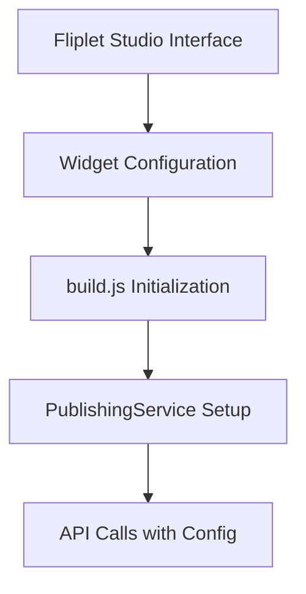
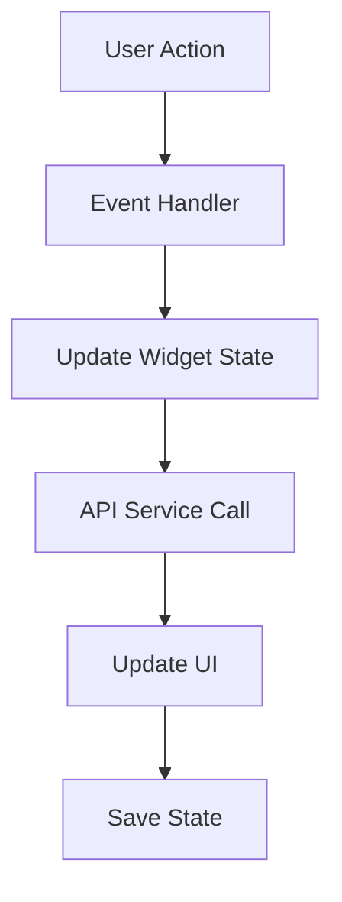
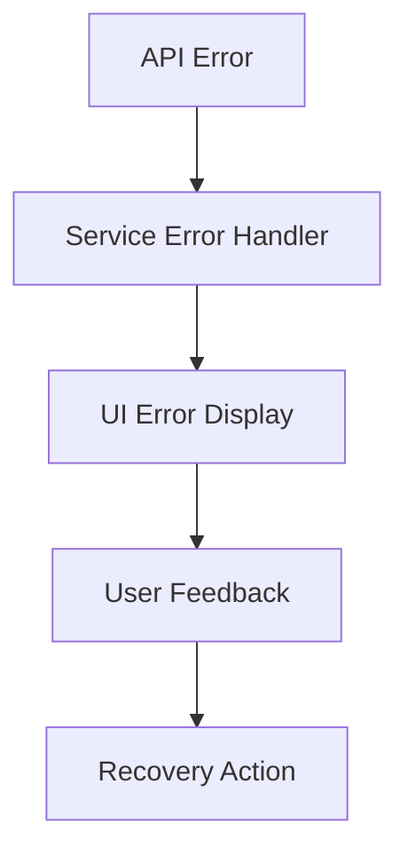

# Code Documentation

This document provides detailed technical documentation for the Publishing Widget codebase, including architecture, key functions, and implementation details.

## 📁 File Structure and Responsibilities

### Core Widget Files

#### `build.html`
**Purpose**: Main widget template and user interface  
**Key Sections**:
- Platform selection screen
- iOS API key configuration
- Multi-step workflow UI
- Error display containers

**Important Elements**:
```html
<!-- Platform selection cards -->
<div class="platform-card" data-platform="ios">
  
<!-- Step navigation indicators -->
<div class="steps">
  <div class="step active">

<!-- Screen containers for workflow steps -->
<div id="ios-api-key-screen" class="screen">
```

#### `build.js`
**Purpose**: Main widget logic and user interaction handling  
**Key Components**:
- Widget initialization
- Screen management
- Event handling
- API service integration

**Core Functions**:
```javascript
// Widget lifecycle
init()                    // Initialize widget and services
setupScreens()           // Configure event listeners
showScreen(screenName)   // Screen navigation

// Platform workflow
selectPlatform(platform)      // Handle platform selection
continueToPlatform()          // Navigate to platform workflow
loadAPIKeys()                 // Load iOS API keys
continueFromAPIKey()          // Process API key selection

// UI management
showError(message)            // Display error messages
showSuccess(message)          // Display success messages
showLoading(element, text)    // Show loading states
hideLoading(element, text)    // Hide loading states
```

#### `css/build.css`
**Purpose**: Widget styling and responsive design  
**Key Features**:
- CSS custom properties (variables)
- Responsive grid layouts
- Component-based styling
- Animation and transitions

**CSS Structure**:
```css
/* Widget container and variables */
.publishing-widget-container { }

/* Screen management */
.screen { display: none; }
.screen.active { display: block; }

/* Platform selection */
.platform-cards { }
.platform-card { }
.platform-card.selected { }

/* Step navigation */
.steps { }
.step { }
.step.active { }
.step.completed { }

/* Form elements */
.form-group { }
.form-control { }
.btn { }

/* Responsive design */
@media (max-width: 768px) { }
```

### Service Layer

#### `js/publishing-service.js`
**Purpose**: Core business logic and API integration  
**Architecture**: Service class with methods organized by functionality

**Class Structure**:
```javascript
class PublishingService {
  // Configuration and state
  constructor(config)
  
  // Utility methods
  buildURL(endpoint)
  validatePlatform(platform)
  validateVersion(version)
  needsNewSubmission(submission)
  
  // Core workflow
  initializeApp()
  getSubmissionState(platform)
  createSubmission(platform, teamId)
  
  // iOS-specific methods
  getAPIKeys()
  createAPIKey(keyData)
  validateAPIKey(keyData)
  checkCertificate(teamId)
  generateCertificate(teamId)
  getBundleIDs(teamId)
  
  // Android-specific methods
  uploadKeystore(submissionId, file, password)
  
  // Common workflow methods
  submitStoreConfig(submissionId, data, platform)
  getPushConfig()
  configurePushNotifications(config)
  uploadImages(files)
  submitMetadata(submissionId, metadata)
  triggerBuild(submissionId)
  cancelBuild(submissionId)
}
```

### Configuration Files

#### `widget.json`
**Purpose**: Widget metadata and dependencies  
**Key Sections**:
```json
{
  "name": "publishing",
  "package": "com.fliplet.publishing",
  "version": "1.0.0",
  "dependencies": ["jquery", "bootstrap"],
  "assets": [
    "css/build.css",
    "js/publishing-service.js",
    "js/build.js"
  ]
}
```

#### `interface.html` & `js/interface.js`
**Purpose**: Widget configuration in Fliplet Studio  
**Features**:
- Platform enable/disable toggles
- Region selection
- Text customization
- Validation and save logic

## 🔧 Key Technical Concepts

### Screen Management

The widget uses a single-page application approach with multiple screens:

```javascript
/**
 * Screen Management System
 * 
 * Screens are managed by showing/hiding DOM elements with CSS classes.
 * Only one screen is visible at a time.
 */
function showScreen(screenName) {
  // Hide all screens
  $element.find('.screen').removeClass('active');
  
  // Show target screen
  $element.find('#' + screenName + '-screen').addClass('active');
  
  // Update state
  state.currentScreen = screenName;
}
```

### State Management

Widget state is maintained in a centralized object:

```javascript
/**
 * Centralized State Management
 * 
 * All widget state is stored in a single object to ensure consistency
 * and enable easy debugging.
 */
var state = {
  service: null,           // PublishingService instance
  currentScreen: 'platform-selection',  // Current visible screen
  selectedPlatform: null,  // ios/android/null
  submissionId: null,      // Current submission ID
  organizationId: null     // Organization ID from API
};
```

### API Integration Pattern

All API calls follow a consistent pattern:

```javascript
/**
 * API Call Pattern
 * 
 * 1. Show loading state
 * 2. Make API call using service
 * 3. Handle success/error
 * 4. Update UI
 * 5. Hide loading state
 */
async function apiCallExample() {
  try {
    showLoading(button, 'Processing...');
    
    const result = await state.service.someMethod();
    
    if (result.success) {
      showSuccess('Operation completed successfully');
      updateUI(result.data);
    } else {
      showError(result.message);
    }
  } catch (error) {
    showError('Operation failed: ' + error.message);
  } finally {
    hideLoading(button, 'Try Again');
  }
}
```

### Error Handling Strategy

The widget implements multi-level error handling:

```javascript
/**
 * Error Handling Levels
 * 
 * 1. Service Level: Catch and format API errors
 * 2. UI Level: Display user-friendly messages
 * 3. Recovery Level: Provide retry mechanisms
 */

// Service level (publishing-service.js)
try {
  const response = await this.ajax(url, method, data);
  return { success: true, data: response };
} catch (error) {
  if (error.responseJSON?.code === 'INVALID_API_KEY') {
    throw new Error('API key is invalid. Please check your credentials.');
  }
  throw new Error(`API call failed: ${error.message}`);
}

// UI level (build.js)
function handleServiceError(error) {
  if (error.message.includes('API key')) {
    showError('API key issue. Please verify your credentials in Apple Developer portal.');
  } else if (error.message.includes('certificate')) {
    showError('Certificate problem. Try generating a new certificate.');
  } else {
    showError(error.message);
  }
}
```

## 🔄 Workflow Implementation

### iOS Publishing Flow

The iOS workflow is implemented as a series of sequential steps:

```javascript
/**
 * iOS Publishing Workflow Steps
 * 
 * Each step validates prerequisites and updates submission state
 */

// Step 1: Platform Selection
selectPlatform('ios') → 
  checkExistingSubmissions() → 
  showPlatformRequirements()

// Step 2: API Key Configuration  
loadAPIKeys() → 
  validateAPIKey() → 
  createSubmission(platform, teamId)

// Step 3: Certificate & Bundle Management
checkCertificate(teamId) → 
  generateCertificate() OR uploadCertificate() → 
  getBundleIDs(teamId) → 
  submitStoreConfig()

// Step 4: Push Configuration (Optional)
getPushConfig() → 
  configurePushNotifications() → 
  submitPushConfig()

// Step 5: Metadata Submission
uploadImages() → 
  submitMetadata() → 
  validateMetadata()

// Step 6: Build Process
triggerBuild() → 
  monitorBuildStatus() → 
  handleBuildCompletion()
```

### State Transitions

Submission states follow a predictable pattern:

```javascript
/**
 * Submission State Machine
 * 
 * States progress linearly with validation at each step
 */
null → 
  'INITIALIZED' → 
  'STORE_CONFIG_SUBMITTED' → 
  'PUSH_NOTIFICATION_CONFIGURED' → 
  'METADATA_SUBMITTED' → 
  'BUILD_TRIGGERED' → 
  ('completed' | 'failed' | 'cancelled')
```

## 📊 Data Flow

### Configuration Data Flow



### User Interaction Flow



### Error Propagation



## 🎯 Performance Considerations

### Optimization Strategies

#### 1. Lazy Loading
```javascript
// Load API keys only when iOS platform is selected
async function continueToPlatform() {
  if (state.selectedPlatform === 'ios') {
    await loadAPIKeys();  // Lazy load
    showScreen('ios-api-key');
  }
}
```

#### 2. Caching
```javascript
// Cache organization data to avoid repeated API calls
if (!state.service.organizationId) {
  await state.service.initializeApp();  // Only call once
}
```

#### 3. Parallel Requests
```javascript
// Load multiple data sources simultaneously
const [apiKeys, certificates, bundleIds] = await Promise.all([
  service.getAPIKeys(),
  service.checkCertificate(teamId),
  service.getBundleIDs(teamId)
]);
```

### Memory Management

```javascript
/**
 * Clean up resources when widget is destroyed
 */
function cleanup() {
  // Clear timeouts and intervals
  if (buildMonitorInterval) {
    clearInterval(buildMonitorInterval);
  }
  
  // Remove event listeners
  $element.off();
  
  // Clear service references
  state.service = null;
}
```

## 🔐 Security Implementation

### Input Validation

```javascript
/**
 * Validate all user inputs before API submission
 */
function validateAPIKeyInput(keyData) {
  // Validate Key ID format
  if (!/^[A-Z0-9]{10}$/.test(keyData.keyId)) {
    throw new Error('Key ID must be 10 alphanumeric characters');
  }
  
  // Validate Issuer ID format
  if (!/^[a-f0-9-]{36}$/.test(keyData.issuerId)) {
    throw new Error('Issuer ID must be a valid UUID');
  }
  
  // Validate private key format
  if (!keyData.privateKey.includes('BEGIN PRIVATE KEY')) {
    throw new Error('Invalid private key format');
  }
}
```

### Secure Data Handling

```javascript
/**
 * Secure handling of sensitive data
 */
function handleSensitiveData(apiKeyData) {
  // Never store private keys in localStorage
  // Only transmit during creation/validation
  
  // Clear sensitive data from memory after use
  setTimeout(() => {
    apiKeyData.privateKey = null;
    apiKeyData = null;
  }, 1000);
}
```

## 🧪 Testing Approach

### Unit Testing Strategy

```javascript
/**
 * Test individual functions in isolation
 */
describe('PublishingService', () => {
  it('should validate platform correctly', () => {
    const service = new PublishingService(mockConfig);
    
    expect(() => service.validatePlatform('ios')).not.toThrow();
    expect(() => service.validatePlatform('invalid')).toThrow();
  });
  
  it('should build URLs correctly', () => {
    const service = new PublishingService(mockConfig);
    const url = service.buildURL('v1/apps/123');
    
    expect(url).toBe('https://api.fliplet.com/v1/apps/123');
  });
});
```

### Integration Testing

```javascript
/**
 * Test complete workflows
 */
describe('iOS Publishing Workflow', () => {
  it('should complete full iOS publishing flow', async () => {
    const service = new PublishingService(mockConfig);
    
    // Initialize app
    await service.initializeApp();
    expect(service.organizationId).toBeTruthy();
    
    // Create submission
    const submission = await service.createSubmission('ios', 'team-id');
    expect(submission.success).toBe(true);
    
    // Check submission state
    const state = await service.getSubmissionState('ios');
    expect(state.currentStep).toBe('api-key');
  });
});
```

### Mock Data for Development

```javascript
/**
 * Mock service for development and testing
 */
class MockPublishingService {
  async getAPIKeys() {
    return {
      success: true,
      apiKeys: [
        {
          id: 'mock-key-1',
          name: 'Development Key',
          keyId: 'MOCK12345',
          teamId: 'mock-team'
        }
      ]
    };
  }
  
  async createSubmission(platform, teamId) {
    await new Promise(resolve => setTimeout(resolve, 1000)); // Simulate delay
    
    return {
      success: true,
      submission: {
        id: 'mock-submission-id',
        platform,
        status: 'started',
        data: { status: 'INITIALIZED', teamId }
      }
    };
  }
}
```

## 📈 Monitoring and Debugging

### Debug Mode Implementation

```javascript
/**
 * Enable detailed logging in development
 */
var DEBUG = Fliplet.Widget.getData().debug || false;

function debugLog(message, data) {
  if (DEBUG) {
    console.log(`[Publishing Widget] ${message}`, data);
  }
}

// Usage throughout codebase
debugLog('API call started', { endpoint, method, data });
debugLog('Screen transition', { from: oldScreen, to: newScreen });
debugLog('State update', { property, oldValue, newValue });
```

### Performance Monitoring

```javascript
/**
 * Measure and log performance metrics
 */
function measurePerformance(operation, fn) {
  return async function(...args) {
    const start = performance.now();
    
    try {
      const result = await fn.apply(this, args);
      const duration = performance.now() - start;
      
      debugLog(`Performance: ${operation}`, { 
        duration: `${duration.toFixed(2)}ms`,
        success: true 
      });
      
      return result;
    } catch (error) {
      const duration = performance.now() - start;
      
      debugLog(`Performance: ${operation} (failed)`, { 
        duration: `${duration.toFixed(2)}ms`,
        error: error.message 
      });
      
      throw error;
    }
  };
}

// Wrap API calls with performance monitoring
service.getAPIKeys = measurePerformance('getAPIKeys', service.getAPIKeys);
```

This comprehensive code documentation provides the technical details needed to understand, maintain, and extend the Publishing Widget codebase.