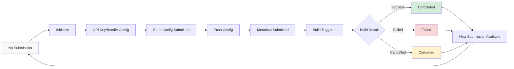
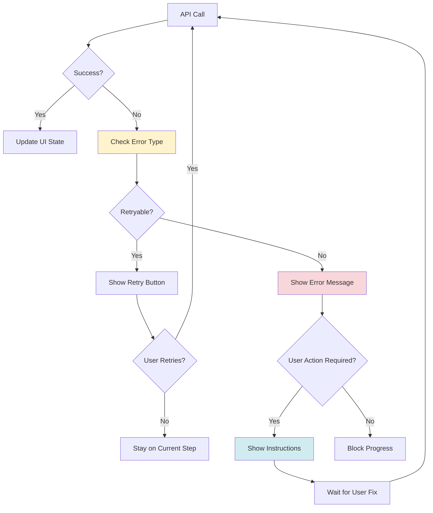
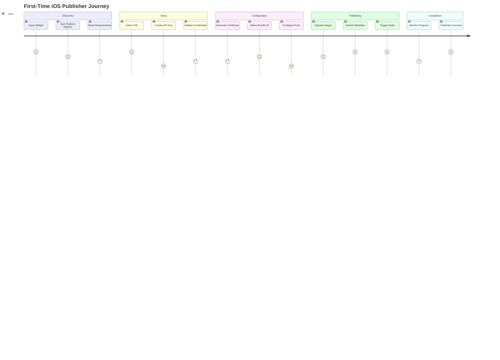
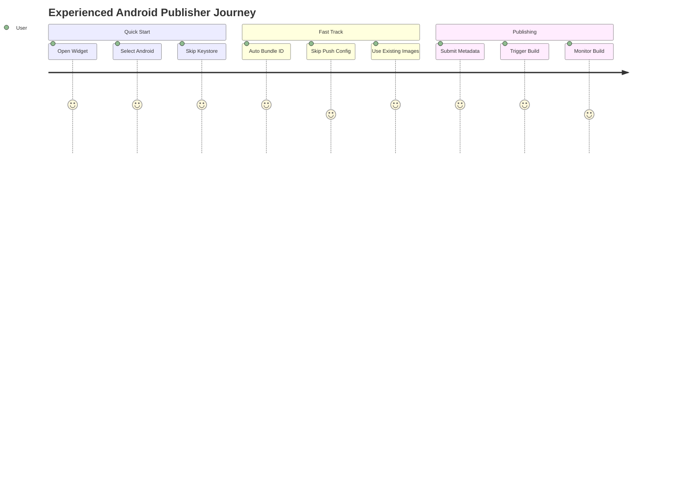
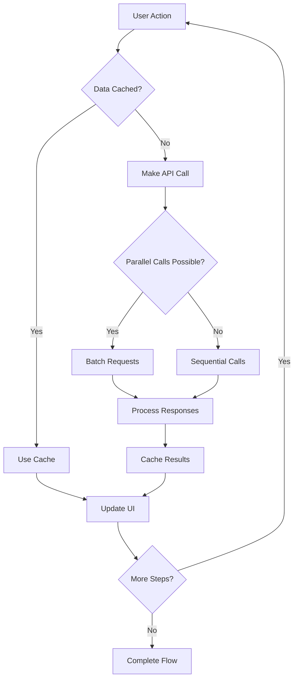
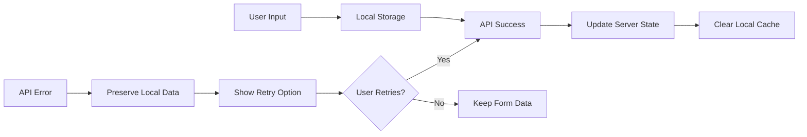

# Publishing Workflow Diagrams

This document provides detailed visual representations of the publishing workflows for both iOS and Android platforms.

## 🔄 iOS Publishing Workflow

### Complete iOS Flow

```mermaid
graph TD
    A[User Opens Widget] --> B[Platform Selection Screen]
    B --> C{Select iOS Platform}
    C --> D[Check Existing Submissions]
    D --> E{Has Active Submission?}
    
    E -->|No| F[Show iOS Requirements]
    E -->|Yes| G[Show Resume Option]
    
    F --> H[Continue to API Key Setup]
    G --> H
    
    H --> I[API Key Configuration]
    I --> J{Has API Keys?}
    J -->|No| K[Create New API Key Form]
    J -->|Yes| L[Select Existing Key]
    
    K --> M[Validate New Key]
    L --> N[Validate Selected Key]
    M --> O[Create Submission]
    N --> O
    
    O --> P[Bundle ID & Certificate]
    P --> Q[Check Certificate Status]
    Q --> R{Certificate Valid?}
    
    R -->|No| S[Generate/Upload Certificate]
    R -->|Yes| T[Fetch Bundle IDs]
    S --> T
    
    T --> U[Select Bundle ID]
    U --> V[Get Version Info]
    V --> W[Submit Store Config]
    
    W --> X[Push Notifications (Optional)]
    X --> Y{Configure Push?}
    Y -->|Yes| Z[Setup Push Config]
    Y -->|No| AA[Skip Push]
    Z --> BB[Submit Push Config]
    AA --> CC[App Store Listing]
    BB --> CC
    
    CC --> DD[Collect Metadata]
    DD --> EE{Upload Images?}
    EE -->|Yes| FF[Upload App Icon/Splash]
    EE -->|No| GG[Use Existing Images]
    FF --> HH[Submit Metadata]
    GG --> HH
    
    HH --> II[Ready to Build]
    II --> JJ[Trigger Build]
    JJ --> KK[Monitor Build Progress]
    KK --> LL{Build Complete?}
    
    LL -->|Success| MM[Show Success Message]
    LL -->|Failed| NN[Show Error & Retry]
    LL -->|In Progress| OO[Continue Monitoring]
    OO --> LL
```

### iOS State Machine

```mermaid
stateDiagram-v2
    [*] --> PlatformSelection
    PlatformSelection --> APIKeyConfig: Select iOS
    
    state APIKeyConfig {
        [*] --> LoadingKeys
        LoadingKeys --> SelectKey: Keys Found
        LoadingKeys --> CreateKey: No Keys
        SelectKey --> ValidateKey
        CreateKey --> ValidateKey
        ValidateKey --> KeyValid: Success
        ValidateKey --> KeyError: Failed
        KeyError --> SelectKey: Retry
        KeyValid --> [*]
    }
    
    APIKeyConfig --> CertificateManagement: Key Configured
    
    state CertificateManagement {
        [*] --> CheckCert
        CheckCert --> CertValid: Valid
        CheckCert --> CertInvalid: Invalid
        CertInvalid --> GenerateCert: Auto Generate
        CertInvalid --> UploadCert: Manual Upload
        GenerateCert --> CertValid
        UploadCert --> CertValid
        CertValid --> FetchBundles
        FetchBundles --> SelectBundle
        SelectBundle --> [*]
    }
    
    CertificateManagement --> StoreConfig: Bundle Selected
    StoreConfig --> PushConfig: Store Submitted
    
    state PushConfig {
        [*] --> CheckPushStatus
        CheckPushStatus --> PushConfigured: Already Set
        CheckPushStatus --> ConfigurePush: Not Set
        CheckPushStatus --> SkipPush: User Skip
        ConfigurePush --> PushConfigured
        PushConfigured --> [*]
        SkipPush --> [*]
    }
    
    PushConfig --> MetadataSubmission: Push Done
    
    state MetadataSubmission {
        [*] --> CollectMetadata
        CollectMetadata --> UploadImages: Has New Images
        CollectMetadata --> SubmitMetadata: No New Images
        UploadImages --> SubmitMetadata
        SubmitMetadata --> [*]
    }
    
    MetadataSubmission --> BuildProcess: Metadata Submitted
    
    state BuildProcess {
        [*] --> TriggerBuild
        TriggerBuild --> Monitoring
        Monitoring --> BuildSuccess: Success
        Monitoring --> BuildFailed: Failed
        Monitoring --> BuildCancelled: Cancelled
        BuildSuccess --> [*]
        BuildFailed --> [*]
        BuildCancelled --> [*]
    }
    
    BuildProcess --> [*]: Build Complete
```



## 🤖 Android Publishing Workflow

### Complete Android Flow

```mermaid
graph TD
    A[User Opens Widget] --> B[Platform Selection Screen]
    B --> C{Select Android Platform}
    C --> D[Check Existing Submissions]
    D --> E{Has Active Submission?}
    
    E -->|No| F[Show Android Requirements]
    E -->|Yes| G[Show Resume Option]
    
    F --> H[Continue to Bundle/Keystore]
    G --> H
    
    H --> I[Bundle ID & Keystore Setup]
    I --> J[Auto-generate Bundle ID]
    J --> K{Upload Keystore?}
    
    K -->|Yes| L[Upload Keystore File]
    K -->|No| M[Use Auto-generated Keystore]
    L --> N[Enter Keystore Password]
    N --> O[Submit Store Config]
    M --> O
    
    O --> P[Push Notifications (Optional)]
    P --> Q{Configure Push?}
    Q -->|Yes| R[Upload Google Services JSON]
    Q -->|No| S[Skip Push]
    R --> T[Setup Push Config]
    S --> U[App Store Listing]
    T --> U
    
    U --> V[Collect Metadata]
    V --> W{Upload Images?}
    W -->|Yes| X[Upload App Icon/Splash]
    W -->|No| Y[Use Existing Images]
    X --> Z[Submit Metadata]
    Y --> Z
    
    Z --> AA[Ready to Build]
    AA --> BB[Trigger Build]
    BB --> CC[Monitor Build Progress]
    CC --> DD{Build Complete?}
    
    DD -->|Success| EE[Show Success Message]
    DD -->|Failed| FF[Show Error & Retry]
    DD -->|In Progress| GG[Continue Monitoring]
    GG --> DD
```

### Android State Machine

```mermaid
stateDiagram-v2
    [*] --> PlatformSelection
    PlatformSelection --> BundleKeystoreConfig: Select Android
    
    state BundleKeystoreConfig {
        [*] --> GenerateBundleID
        GenerateBundleID --> KeystoreChoice
        KeystoreChoice --> UploadKeystore: User Upload
        KeystoreChoice --> AutoKeystore: Auto Generate
        UploadKeystore --> ValidateKeystore
        ValidateKeystore --> StoreConfigReady: Valid
        ValidateKeystore --> KeystoreError: Invalid
        KeystoreError --> KeystoreChoice: Retry
        AutoKeystore --> StoreConfigReady
        StoreConfigReady --> [*]
    }
    
    BundleKeystoreConfig --> PushConfig: Store Config Done
    
    state PushConfig {
        [*] --> CheckPushStatus
        CheckPushStatus --> UploadGoogleServices: Configure
        CheckPushStatus --> SkipPush: Skip
        UploadGoogleServices --> ValidateServices
        ValidateServices --> PushConfigured: Valid
        ValidateServices --> PushError: Invalid
        PushError --> UploadGoogleServices: Retry
        PushConfigured --> [*]
        SkipPush --> [*]
    }
    
    PushConfig --> MetadataSubmission: Push Done
    
    state MetadataSubmission {
        [*] --> CollectMetadata
        CollectMetadata --> UploadImages: Has New Images
        CollectMetadata --> SubmitMetadata: No New Images
        UploadImages --> ValidateImages
        ValidateImages --> SubmitMetadata: Valid
        ValidateImages --> ImageError: Invalid
        ImageError --> UploadImages: Retry
        SubmitMetadata --> [*]
    }
    
    MetadataSubmission --> BuildProcess: Metadata Submitted
    
    state BuildProcess {
        [*] --> TriggerBuild
        TriggerBuild --> Monitoring
        Monitoring --> BuildSuccess: Success
        Monitoring --> BuildFailed: Failed
        Monitoring --> BuildCancelled: Cancelled
        BuildSuccess --> [*]
        BuildFailed --> [*]
        BuildCancelled --> [*]
    }
    
    BuildProcess --> [*]: Build Complete
```



## 🔄 Cross-Platform Submission States

### Submission Lifecycle



### Error Handling Flow



## 🎯 User Journey Maps

### First-Time iOS Publisher



### Experienced Android Publisher



## 📊 Performance Considerations

### API Call Optimization



### State Persistence Strategy



## 🔧 Implementation Notes

### Key Decision Points

1. **Platform Selection**: 
   - Check existing submissions first
   - Allow resuming interrupted workflows
   - Clear previous errors on platform switch

2. **API Key Management**:
   - Validate keys before proceeding
   - Cache team information
   - Handle expired credentials gracefully

3. **Certificate Handling**:
   - Auto-generate when possible
   - Provide manual upload fallback
   - Validate certificate-team associations

4. **Build Monitoring**:
   - Implement efficient polling
   - Provide real-time status updates
   - Handle build cancellation properly

5. **Error Recovery**:
   - Preserve user input during errors
   - Provide clear error messages
   - Offer actionable recovery steps

### Widget State Management

The widget maintains state at multiple levels:

- **Screen State**: Current visible screen and navigation
- **Form State**: User input data and validation
- **Service State**: API responses and submission status
- **Error State**: Current errors and retry options

This multi-level approach ensures that users never lose progress and can always resume their publishing workflow from where they left off.